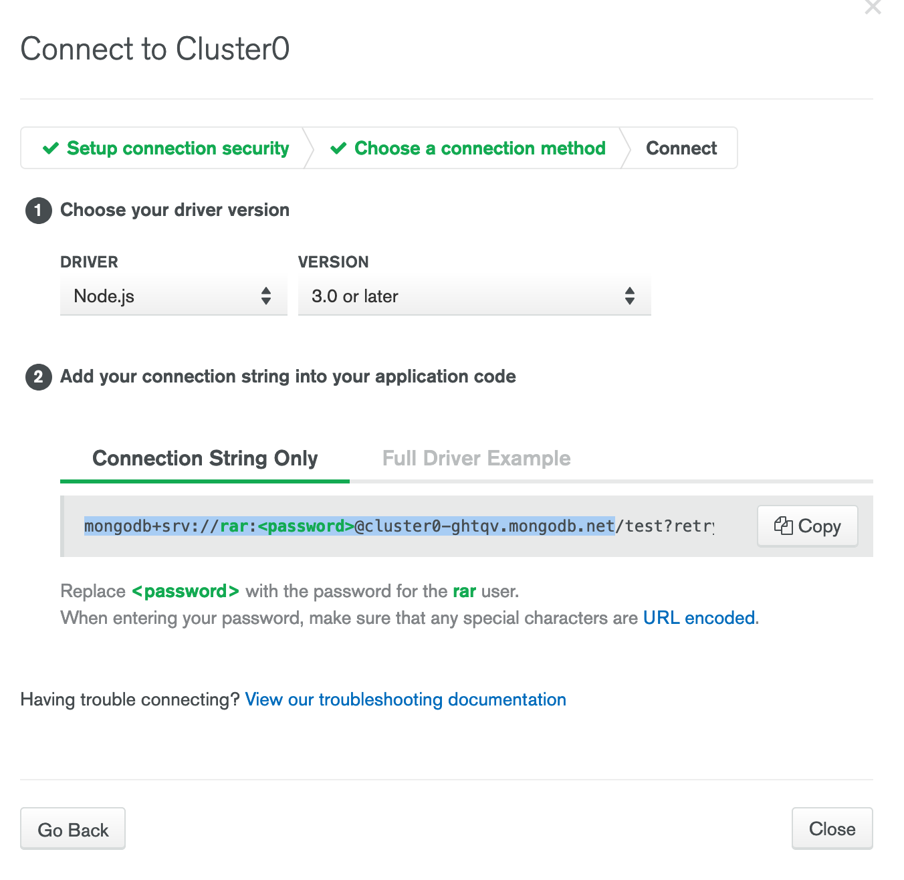
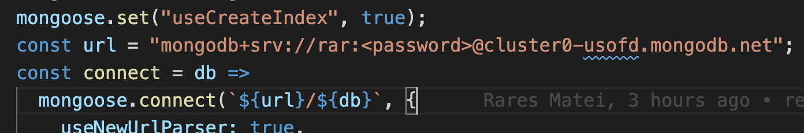

### Setting up

1. Download and install [POSTMAN](https://www.getpostman.com/)
2. Go to [AtlasDB](https://cloud.mongodb.com/) and register for a new account
3. Chose "Starter Clusters" on the left and click "Create a cluster"
4. Chose "AWS" on the top row
5. Chose "Ireland"
6. Click "Create cluster" at the bottom
7. Wait for your cluster to be created
8. Click on "Connect"
9. Click on "Add your current IP Address" and add it
10. Enter a username and password below - IMPORTANT: chose a stupid/random password, don't use your main password. Make sure you remember both the user and the password!
11. "Choose a connection method" --> "Connect to your Application"
12. Chose "NodeJS" from the Driver list
13. Copy the connection string up to and including `..mongodb.net`

14. Open up the file `exercises/` and paste in your string into the `url` variable. It should look like this:

15. Replace `<password>` in the url with the password you created in step 10.
16. Run `npm install`

### Models

- location - `exercises/models`
- commands
  - test - `npm test exercises/models/__test__/`

This exercise will have you create connection logic and mongoose schemas. Using the schema, you must create some CRUD functionality.

- [ ] finish the user schema so that the the user model tests pass
- [ ] complete the crud functions with the user model and get all the crud test to pass

### Queries

- location - `exercises/queries`
- commands
  - test - `npm run test exercises/queries/__test__/`

This exercise will have you add relationships between models. You'll then use those models to create slightly more advanced queries than the last exercise

- [ ] the post model should have have a one-to-one author field that points to the author collection
- [ ] the post model should have a one-to-many similarPost field that points to posts
- [ ] get all the post model tests to pass
- [ ] get all the query tests to pass

### App

- location - `exercises/app`
- commands
  - start the server - `npm start`

In this exercise, you'll have to create queries in ExpressJS controllers to satisfy the request. You'll learn how to use mongodb in an API environment.

- [ ] start the server
- [ ] open up POSTMAN
- [ ] create db query for `GET /todo/:id`
- [ ] create db query for `GET /todo`
- [ ] create db mutation for `POST /todo/`
